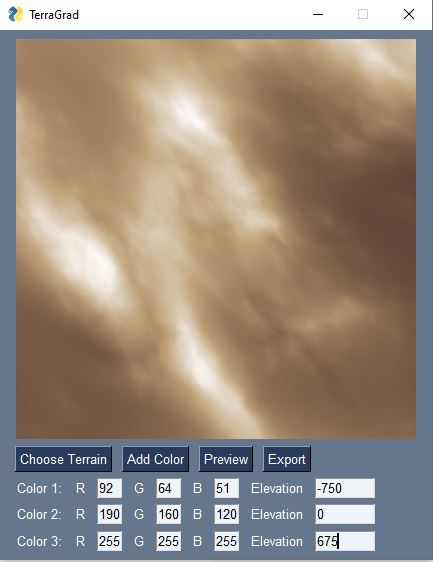

# TerraGrad

A tool for applying color gradients to a heightfield.  Built for use with Terragen, but can be used with any terrain generator that can export a .exr file.

Required Python packages: numpy, matplotlib, imageio, PySimpleGUI, PIL
